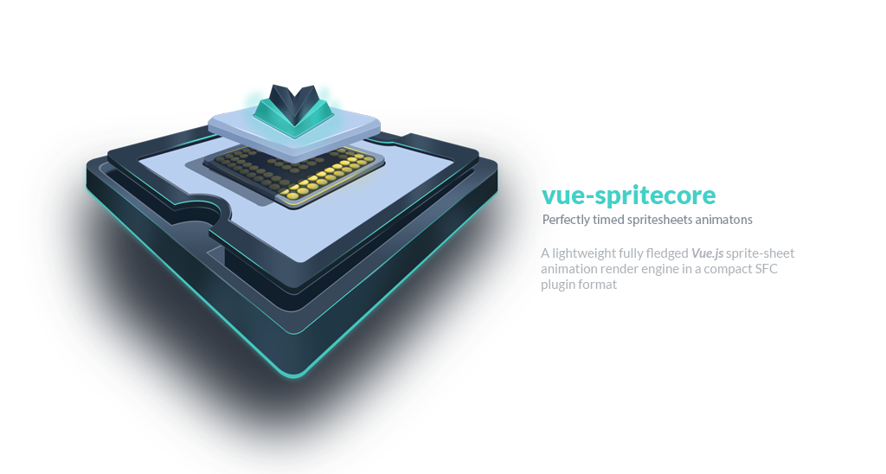

# vue-spritecore
> A Fully fledged Vue sprite-sheet animation render engine in a compact SFC plugin

[ ](https://www.npmjs.com/package/vue-spritecore)
[](https://vuejs.org/)


<span style="display:block;text-align:center">
    
</span>


## Table of contents

- [Installation](#installation)
- [Usage](#usage)
- [Example](#example)
- [Props](#Props)
- [Events](#Events)

# Installation

```
npm install --save vue-spritecore
```

## Default import

Install for all the components (global registration):

```javascript
import Vue from 'vue'
import VueSpritecore from 'vue-spritecore'

Vue.use(VueSpritecore)

new Vue({
  components: { App },
  template: '<App/>'
}).$mount('#app')
```

Use within a specific component (local registration):

```javascript
import Vue from 'vue'
import { VueSpritecore } from 'vue-spritecore'

Vue.component('vue-spritecore', VueSpritecore)
```
# Usage
> Generate your spritesheet

* `spritesheet`: must be a valid image file (*reccomended* .png)
* `json`: animation-data in **JSON Array** format

You can generate the spritesheet also through any of the following online tools:

* https://www.codeandweb.com/free-sprite-sheet-packer
* https://www.leshylabs.com/apps/sstool/

---

> Add the component

```vue
<vue-spritecore
    v-bind:id="'animation-id'"
    v-bind:spritesheet="require('./assets/spritesheet.png')"
    v-bind:json="require('./assets/animation-data/spritesheet-data.json')"
    v-bind:autoplay="true"
    v-bind:loop="true"


    v-on:ready="ready"
    ref="animation"

></vue-spritecore>
```

> Wait for the animation to be ready then start animating

```vue
export default {
  name: 'app',

  mounted: function(){
  },
  methods: {
    ready: function(){
      this.$refs.animation.play();
    },
  }
}
```

# Example
> Props and methods syntax example

```vue
<template>
  <div id="app">
    <vue-spritecore
        v-bind:id="'animation-id'"
        v-bind:spritesheet="require('./assets/spritesheet.png')"
        v-bind:json="require('./assets/animation-data/spritesheet-data.json')"
        v-bind:autoplay="true"
        frameSorting="asc"
        v-bind:scaleX="0.6"
        v-bind:scaleY="0.6"
        v-bind:loop="true"
        v-bind:lowerBound="0"
        v-bind:upperBound="100"

        v-on:ready="ready"
        v-on:animationStarted="animationStarted(...arguments)"
        v-on:animationStopped="animationStopped(...arguments)"
        v-on:animationReset="animationReset(...arguments)"
        v-on:animationOver="animationOver(...arguments)"

        ref="animation"

    ></vue-spritecore>
  </div>
</template>

<script>

export default {
  name: 'app',

  mounted: function(){
    this.$refs.animation.play();            //play the animation from frame _lowerBound_ to _upperBound_
    this.$refs.animation.play(5, 40);       //play the animation from frame 5 to frame 40
    this.$refs.animation.stop();            //stop(freeze) the animation
    this.$refs.animation.reset();           //reset the animation at frame _lowerBound_
    this.$refs.animation.reset(10);         //reset the animation at frame 10
    this.$refs.animation.playLegacy(30);    //play the animation throught the legacy animator with constant framerate of 30
  },
  methods: {
    ready: function(){
      console.log('animation ready');
    },
    animationStarted: function(startFrame, stopFrame){
    console.log('animation started:['+startFrame+','+stopFrame+']');
    },
    animationStopped: function(frame){
    console.log('animation stopped at frame: '+frame);
    },
    animationReset: function(frame){
     console.log('animation resetted at frame: '+frame);
    },
    animationOver: function(frame){
     console.log('animation over at frame:'+frame);
    },

  }
}
</script>
```
# Props
* `spritesheet` *(required)* : path to the animation sprite-sheet
* `json` *(required)*: path to the json animation data
* `id` : render canvas id
* `frameSorting`: frame sorting method when arranging the frames from the provided json. It determines the animation direction.
* `scaleX`: animation scale on the x-axis
* `scaleY` *: animation scale on the y-axis
* `autoplay` : automatic animation play
* `loop`: restart animation automatically at _lowerBound_
* `lowerBound` : global animation start frame cursor
* `upperBound` : global animation end frame cursor
<br/><br/>

Name | Required | Type [ allowable params ] | Default
------------------ | ----- | --------- | ------------
spritesheet  | true | String | -
json | true  | String | -
id   | false | String | vue-spritecore-canvas
frameSorting | false | String [ 'asc', 'desc'] | 'asc'
scaleX   | false | Number | 1
scaleY   | false | Number | 1
autoplay   | false | Boolean | false
loop   | false | Boolean | true
lowerBound   | false | Number | 0
upperBound   | false | Number | _animationLength_


# Events

* `ready` : assets has been loaded and animation is ready
* `animationStarted` : animation started
* `animationStopped` : animation stopped
* `animationReset` : animation has been reset
* `animationOver` : animation is over
<br/><br/>

Name | Arguments
------ | -------
ready | -
animationStarted | startFrame, stopFrame
animationStopped | frame
animationReset | frame
animationOver | frame

---
## License

[MIT](http://opensource.org/licenses/MIT)
